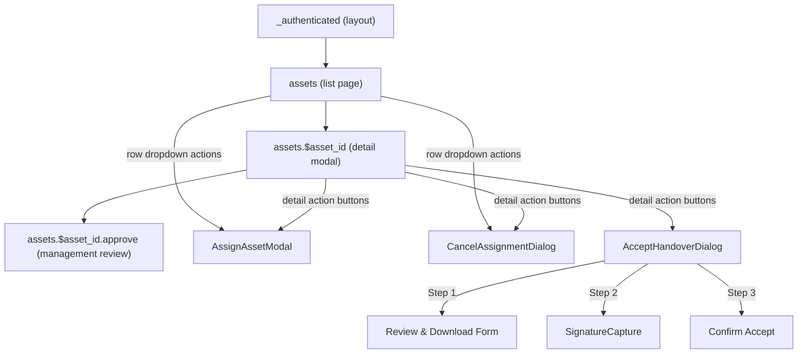
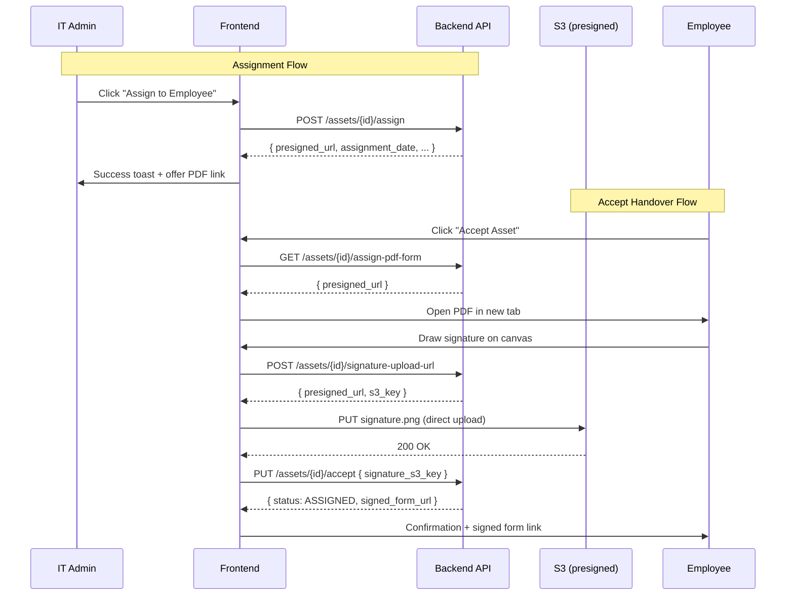

# Design Document: Asset Assignment & Handover

## Overview

This design covers the frontend implementation for Phase 2 of the Gadget Management System: Asset Assignment & Handover. The feature enables IT Admins to assign IN_STOCK assets to employees via a single API call that creates the assignment, generates a handover PDF, and emails the employee. Employees can then review the handover form, provide a digital signature, and accept the asset. IT Admins can cancel pending assignments and audit employee signature history.

The implementation extends the existing React/TypeScript frontend built with TanStack Router (file-based routing), TanStack Query (server state), TanStack Form (form handling), and Shadcn UI (component library). All new hooks are added to `src/hooks/use-assets.ts`, all new types to `src/lib/models/types.ts`, and query keys to `src/lib/query-keys.ts`, following established codebase patterns.

The backend API is fully implemented. The frontend consumes six endpoints:
- `POST /assets/{asset_id}/assign` — assign + PDF generation + email (single call)
- `GET /assets/{asset_id}/assign-pdf-form` — get handover form presigned URL
- `POST /assets/{asset_id}/signature-upload-url` — get presigned PUT URL for signature
- `PUT /assets/{asset_id}/accept` — accept handover with signature
- `DELETE /assets/{asset_id}/cancel-assignment` — cancel pending assignment
- `GET /users/{employee_id}/signatures` — list employee handover signatures

## Architecture

### Component Hierarchy



### Data Flow



### Routing Changes

The existing route guard on `assets.$asset_id.tsx` restricts access to `['it-admin', 'management']`. This must be expanded to include `'employee'` so assigned employees can view their asset detail and complete the handover flow. The `beforeLoad` guard remains — it just adds `'employee'` to the `DETAIL_ALLOWED` array.

No new route files are needed. All assignment/handover UI is rendered as modal dialogs opened from the existing asset detail page and asset list page. The signatures section is added to the existing users page.

### State Management

All server state flows through TanStack Query hooks. No new React Context or global state is introduced. Component-local state manages:
- Modal open/close state
- Multi-step wizard progression (Accept Handover Dialog)
- Signature canvas data
- Presigned URL expiry detection

## Components and Interfaces

### New Components

#### 1. AssignAssetModal
- Location: `src/components/assets/AssignAssetModal.tsx`
- Props: `{ open: boolean; onOpenChange: (open: boolean) => void; assetId: string }`
- Renders a Shadcn Dialog with:
  - `<Autocomplete>` for employee search (uses `useUsers` with `status=active&role=employee` filter)
  - Optional notes `<Textarea>`
  - Confirm button in `<DialogFooter>`
- Uses `useAssignAsset` mutation hook
- On success: shows toast, optionally opens PDF link, calls `onOpenChange(false)`
- On error: displays API error message inline via `alert-danger`

#### 2. AcceptHandoverDialog
- Location: `src/components/assets/AcceptHandoverDialog.tsx`
- Props: `{ open: boolean; onOpenChange: (open: boolean) => void; assetId: string; asset: { brand?: string; model?: string; serial_number?: string; status: AssetStatus } }`
- Multi-step wizard (3 steps) managed by local `step` state:
  - Step 1: Asset summary + "Download Handover Form" button + review checkbox
  - Step 2: `<SignatureCapture>` component + upload logic
  - Step 3: "Agree & Accept Asset" confirmation
- Uses `useHandoverForm`, `useSignatureUploadUrl`, `useAcceptHandover` hooks
- Stores `s3_key` in component state between steps 2 and 3

#### 3. SignatureCapture
- Location: `src/components/assets/SignatureCapture.tsx`
- Props: `{ onSignatureReady: (blob: Blob) => void; disabled?: boolean }`
- Wraps `react-signature-canvas` library (already in `package.json`)
- Provides canvas drawing pad with Clear/Undo controls
- Exports signature as PNG Blob via `onSignatureReady` callback
- Includes file upload fallback for PNG signature images

#### 4. CancelAssignmentDialog
- Location: `src/components/assets/CancelAssignmentDialog.tsx`
- Props: `{ open: boolean; onOpenChange: (open: boolean) => void; assetId: string }`
- Destructive confirmation dialog with warning message
- Uses `useCancelAssignment` mutation hook
- On success: shows toast, closes dialog
- On error: displays API error message inline

#### 5. EmployeeSignaturesSection
- Location: `src/components/assets/EmployeeSignaturesSection.tsx`
- Props: `{ employeeId: string }`
- Renders a `<DataTable>` with signature columns
- Uses `useEmployeeSignatures` hook with pagination and date range filters
- Date filters use the Dialog-based filter pattern from the steering docs
- Empty state: "No handover signatures on record."

### Modified Components

#### assets.$asset_id.tsx (Asset Detail Modal)
- Expand `DETAIL_ALLOWED` to include `'employee'`
- Add conditional action buttons based on role + asset state + handover status
- Accept `assignment_date` via route search params or state to detect pending handover
- Render `<AssignAssetModal>`, `<AcceptHandoverDialog>`, `<CancelAssignmentDialog>` as needed

#### assets.tsx (Asset List Page)
- Add dropdown menu (⋯) to the actions column following the table-actions steering protocol
- Dropdown items conditionally rendered per role/status/handover state:
  - IT Admin + IN_STOCK + no handover → "Assign to Employee"
  - IT Admin + IN_STOCK + pending handover → "View Handover Form", "Cancel Assignment"
  - IT Admin + ASSIGNED → "View Handover Form"
  - Employee + assigned to them + IN_STOCK + pending → "View Handover Form", "Accept Asset"
  - Employee + assigned to them + ASSIGNED → "View Handover Form"
- Hide dropdown trigger when no actions available

### New Hooks (all in `src/hooks/use-assets.ts`)

| Hook | Type | Endpoint | Cache Invalidation |
|------|------|----------|-------------------|
| `useAssignAsset` | mutation | `POST /assets/{id}/assign` | `queryKeys.assets.all()` on settled |
| `useCancelAssignment` | mutation | `DELETE /assets/{id}/cancel-assignment` | `queryKeys.assets.all()` on settled |
| `useAcceptHandover` | mutation | `PUT /assets/{id}/accept` | `queryKeys.assets.all()` on settled |
| `useHandoverForm` | mutation | `GET /assets/{id}/assign-pdf-form` | None (one-shot fetch for presigned URL) |
| `useSignatureUploadUrl` | mutation | `POST /assets/{id}/signature-upload-url` | None (one-shot) |
| `useEmployeeSignatures` | query | `GET /users/{id}/signatures` | Uses `queryKeys.assets.signatures()` |

Note: `useHandoverForm` is a mutation (not a query) because it's triggered on-demand by button click and returns a short-lived presigned URL — caching it would cause stale URL issues.

## Data Models

### New TypeScript Types (already partially defined in `types.ts`)

The following types are already declared in `src/lib/models/types.ts` and need no changes:

```typescript
// Already exists
type AssignAssetRequest = { employee_id: string; notes?: string }
type AssignAssetResponse = {
    asset_id: string
    employee_id: string
    assignment_date: string
    status: AssetStatus
    presigned_url: string
}
type CancelAssignmentResponse = { asset_id: string; status: AssetStatus }
type GetHandoverFormResponse = { asset_id: string; presigned_url: string }
type GenerateSignatureUploadUrlResponse = { presigned_url: string; s3_key: string; asset_id: string }
type AcceptHandoverRequest = { signature_s3_key: string }
type AcceptHandoverResponse = { asset_id: string; status: AssetStatus; signed_form_url: string }
type SignatureItem = {
    asset_id: string; brand?: string; model?: string;
    assignment_date: string; signature_timestamp: string; signature_url: string
}
```

### New Type to Add

```typescript
// Paginated signature list response
type ListSignaturesFilter = PaginatedAPIFilter & {
    assignment_date_from?: string
    assignment_date_to?: string
}
type ListSignaturesResponse = PaginatedAPIResponse<SignatureItem>
```

### Query Key Extensions

```typescript
// Additions to queryKeys in src/lib/query-keys.ts
assets: {
    // ... existing keys ...
    handoverForm: (assetId: string) =>
        [...queryKeys.assets.all(), 'handover-form', assetId] as const,
    signatures: (employeeId: string, params: { page: number; page_size: number; filters?: any }) =>
        [...queryKeys.assets.all(), 'signatures', employeeId, params] as const,
}
```

### Handover State Detection Logic

The asset list endpoint returns `assignment_date` on `AssetItem`. The detail endpoint does NOT return it. To bridge this gap:

1. When navigating from the list to detail, pass `assignment_date` via TanStack Router search params (e.g. `?assignment_date=2025-01-15`)
2. On the detail page, read `assignment_date` from search params
3. Derive handover state:
   - `status === 'IN_STOCK' && assignment_date` → Pending Handover
   - `status === 'ASSIGNED' && assignment_date` → Completed Handover
   - `status === 'IN_STOCK' && !assignment_date` → Available for assignment
4. Fallback: if `assignment_date` is not in search params (direct URL access), call `GET /assets/{id}/assign-pdf-form` — a 404 means no handover exists, success means one does


## Correctness Properties

*A property is a characteristic or behavior that should hold true across all valid executions of a system — essentially, a formal statement about what the system should do. Properties serve as the bridge between human-readable specifications and machine-verifiable correctness guarantees.*

### Property 1: Handover state classification is deterministic and exhaustive

*For any* asset object with any combination of `status` (from the `AssetStatus` union) and `assignment_date` (present or absent), the `getHandoverState(status, assignmentDate)` function shall return exactly one of `'pending'`, `'completed'`, or `'available'` — where `IN_STOCK` + `assignment_date` present → `'pending'`, `ASSIGNED` + `assignment_date` present → `'completed'`, `IN_STOCK` + no `assignment_date` → `'available'`, and all other combinations → `'none'`.

**Validates: Requirements 6.1, 6.2, 6.3**

### Property 2: Action visibility is consistent with role, status, and handover state

*For any* combination of `(userRole, assetStatus, handoverState, isAssignedUser)`, the function `getVisibleActions(role, status, handoverState, isAssignedUser)` shall return a set of action identifiers that exactly matches the expected visibility rules:
- `it-admin` + `IN_STOCK` + `available` → `['assign']`
- `it-admin` + `IN_STOCK` + `pending` → `['view-handover-form', 'cancel-assignment']`
- `it-admin` + `ASSIGNED` + `completed` → `['view-handover-form']`
- `employee` + `IN_STOCK` + `pending` + assigned → `['view-handover-form', 'accept-asset']`
- `employee` + `ASSIGNED` + `completed` + assigned → `['view-handover-form']`
- `management` or `finance` for any status → `[]`
- Any role where `isAssignedUser` is false for employee-specific actions → those actions excluded

**Validates: Requirements 1.1, 2.1, 2.2, 3.1, 4.1, 7.2, 7.3, 7.4, 7.5, 7.6, 7.7, 7.8, 7.9, 7.10, 9.2**

### Property 3: Signature table rows contain all required formatted fields

*For any* `SignatureItem` object with arbitrary field values, the rendered table row shall contain: the `asset_id` as a link to the asset detail page, the `brand` value (or dash placeholder), the `model` value (or dash placeholder), the `assignment_date` formatted via `formatDate`, the `signature_timestamp` formatted via `formatDate`, and the `signature_url` as a clickable element.

**Validates: Requirements 5.3**

### Property 4: Successful assignment mutations invalidate asset caches

*For any* successful invocation of `useAssignAsset`, `useCancelAssignment`, or `useAcceptHandover`, the mutation's `onSettled` callback shall call `queryClient.invalidateQueries` with a query key that matches `queryKeys.assets.all()`, ensuring all asset list and detail queries are refetched.

**Validates: Requirements 1.8, 3.14, 4.5**

## Error Handling

### API Error Display Pattern

All assignment/handover API errors follow the existing `ApiError` pattern from `src/lib/api-client.ts`. The API returns `{ "message": "..." }` for all 4xx errors. Error messages are displayed inline using the `alert-danger` CSS class, consistent with the approve flow in `assets.$asset_id.approve.tsx`.

### Error Categories

| Endpoint | Status | Message Pattern | UI Behavior |
|----------|--------|----------------|-------------|
| POST /assign | 409 | "This Asset has been assigned to {name}" | Show message in modal, keep modal open |
| POST /assign | 409 | "This Asset is in progress to be assigned to {name}" | Show message in modal |
| POST /assign | 409 | "Asset must be in IN_STOCK status to be assigned" | Show message in modal |
| POST /assign | 404 | "Active employee not found" | Show message in modal |
| GET /assign-pdf-form | 404 | "Handover form has not been generated yet" | Show message inline |
| GET /assign-pdf-form | 404 | "No assignment found for this asset" | Show message inline |
| GET /assign-pdf-form | 403 | "You are not assigned to this asset" | Show message inline |
| PUT /accept | 409 | "Handover form must be generated before acceptance" | Show message + "Contact IT Admin" guidance |
| PUT /accept | 409 | "Asset is not in a state that allows handover acceptance" | Show message in dialog |
| PUT /accept | 400 | "Signature image not found in S3" | Show message + retry prompt |
| DELETE /cancel-assignment | 409 | "Cannot cancel assignment after employee has accepted" | Show message in dialog |
| DELETE /cancel-assignment | 404 | "No pending assignment found for this asset" | Show message in dialog |

### Presigned URL Expiry Handling

Presigned URLs have TTLs (60 min for handover forms, 15 min for signature uploads). When a fetch to an S3 presigned URL returns 403:

1. Detect the 403 status in the fetch response
2. Display: "This link has expired. Please refresh to get a new one."
3. Provide a "Refresh" button that re-calls the appropriate API endpoint to get a fresh presigned URL
4. This pattern is already used in `PresignedImage` component for gadget photos — extend the same approach

### Signature Upload Error Recovery

The signature upload is a two-step process (get presigned URL → PUT to S3). If the S3 PUT fails:
1. Show an error message in the dialog
2. Keep the user on Step 2
3. Allow them to re-draw/re-upload the signature
4. On retry, request a new presigned URL before uploading

## Testing Strategy

### Dual Testing Approach

This feature uses both unit tests and property-based tests for comprehensive coverage:

- **Unit tests** (Vitest): Verify specific examples, edge cases, error conditions, and UI interactions
- **Property-based tests** (fast-check via Vitest): Verify universal properties across randomly generated inputs

### Property-Based Testing Configuration

- Library: `fast-check` (compatible with Vitest)
- Minimum iterations: 100 per property test
- Each property test references its design document property via comment tag
- Tag format: `Feature: asset-assignment-handover, Property {number}: {property_text}`

### Property Test Plan

| Property | Test Description | Generator Strategy |
|----------|-----------------|-------------------|
| Property 1 | Handover state classification | Generate random `(AssetStatus, assignmentDate \| undefined)` tuples, verify classification output |
| Property 2 | Action visibility rules | Generate random `(UserRole, AssetStatus, handoverState, isAssignedUser)` tuples, verify visible actions set |
| Property 3 | Signature table row content | Generate random `SignatureItem` objects with arbitrary strings/dates, verify rendered output contains all fields |
| Property 4 | Cache invalidation | Generate random asset IDs, invoke each mutation hook, verify `invalidateQueries` called with correct key |

### Unit Test Plan

| Area | Tests |
|------|-------|
| AssignAssetModal | Renders employee selector, submits correct payload, shows success toast, shows error messages for 409/404 |
| AcceptHandoverDialog | Step progression (1→2→3), checkbox gating, signature upload flow, accept API call, error states |
| CancelAssignmentDialog | Confirmation message, API call on confirm, success toast, error messages for 409/404 |
| SignatureCapture | Canvas renders, clear button works, exports PNG blob, file upload fallback |
| EmployeeSignaturesSection | Table renders columns, pagination works, date filters apply, empty state message |
| Route guard | Employee role allowed on asset detail, management-only actions hidden for employee |
| Presigned URL expiry | 403 detection, refresh prompt, re-fetch behavior |

### Test File Organization

- Property tests: `src/__tests__/properties/asset-assignment-handover.test.ts`
- Unit tests: `src/__tests__/components/assign-asset-modal.test.tsx`, etc.
- Each property test must include the tag comment: `// Feature: asset-assignment-handover, Property N: ...`
- Each property test must run a minimum of 100 iterations via `fc.assert(fc.property(...), { numRuns: 100 })`
