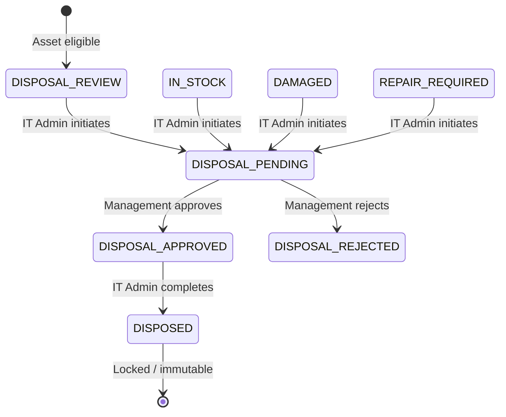
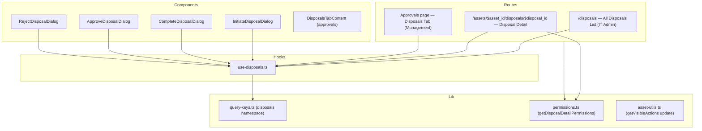

# Design Document: Asset Disposal Process

## Overview

This feature implements the complete asset disposal workflow in the Gadget Management System frontend. The flow involves three actors: IT Admin (initiates and completes disposals), Management (reviews/approves/rejects), and Finance (notified automatically by the backend). The implementation adds new routes, dialog components, custom hooks, query keys, permission functions, and navigation items — all integrated into the existing React/TypeScript/TanStack application.

The disposal lifecycle follows this state machine:



## Architecture

The feature follows the established layered architecture of the existing codebase:



### Key Architectural Decisions

1. **Separate Approve/Reject dialogs** instead of a single dialog with radio buttons (like ManagementReviewIssueDialog). The screenshots show distinct dialogs for approve vs reject, and the reject flow has a required field while approve has an optional one. Separate dialogs keep each simpler and match the UI inspiration.

2. **Disposal Detail as a nested route** under `assets.$asset_id.disposals.$disposal_id.tsx`. This follows the existing pattern for issue and return detail pages, keeping the asset context available.

3. **DisposalsTabContent** replaces the placeholder "Disposals" tab in the existing approvals page, following the same pattern as ReplacementTabContent and SoftwareRequestsTabContent.

4. **Immutability enforcement** is handled at two levels: the Asset Detail page checks `asset.status === 'DISPOSED'` to hide all actions and show a banner, and the Disposal Detail page checks `is_locked` from the API response.

## Components and Interfaces

### New Components

#### `src/components/disposals/InitiateDisposalDialog.tsx`

Dialog triggered from QuickActionsCard on the Asset Detail page.

```typescript
type InitiateDisposalDialogProps = {
    open: boolean
    onOpenChange: (open: boolean) => void
    assetId: string
    asset: {
        brand?: string
        model?: string
        serial_number?: string
        cost?: number
        category?: string
    }
}
```

**UI Layout** (adapted from Screenshot 1):
- DialogHeader: "Initiate Disposal" title
- Scrollable content area with `-mx-1 px-1` pattern:
  - "ASSET DETAILS" section: read-only card showing brand, model, serial number, cost (formatNumber), and category from the asset record
  - "Disposal Reason" — text Input (required). Per the API types, `disposal_reason` is a free text string, not a dropdown.
  - "Justification" — Textarea (required), placeholder: "Provide detailed justification for the disposal request..."
- DialogFooter: "Cancel" (outline) + "Submit Request" (default, with icon)
- Form: TanStack Form with Zod validation (both fields non-empty, trimmed)
- On success: toast.success, close dialog, invalidate asset detail query
- Error handling: 400 → toast, 404 → toast "Asset not found", 409 → toast "Asset is not in a valid status for disposal"

#### `src/components/disposals/CompleteDisposalDialog.tsx`

Dialog triggered from Disposal Detail page action buttons.

```typescript
type CompleteDisposalDialogProps = {
    open: boolean
    onOpenChange: (open: boolean) => void
    assetId: string
    disposalId: string
    disposal: {
        disposal_reason: string
        justification: string
    }
}
```

**UI Layout** (adapted from Screenshot 2):
- DialogHeader: "Complete Disposal" title
- Scrollable content:
  - Read-only "Disposal Reason" and "Justification" fields showing context
  - "Disposal Date" — date picker (required, format YYYY-MM-DD)
  - "Data Wipe Confirmed" — Checkbox (required, must be true)
  - Warning banner when checkbox unchecked: "You must confirm that the device data has been wiped before completing the disposal."
- DialogFooter: "Cancel" (outline) + "Confirm Disposal" (destructive variant, disabled when checkbox unchecked)
- On success: toast.success + conditional finance notification toast (COMPLETED → info, NO_FINANCE_USERS → warning, FAILED → warning)
- Error handling: 400 → toast, 409 → toast

#### `src/components/disposals/ApproveDisposalDialog.tsx`

```typescript
type ApproveDisposalDialogProps = {
    open: boolean
    onOpenChange: (open: boolean) => void
    assetId: string
    disposalId: string
}
```

**UI Layout** (adapted from Screenshot 3):
- DialogHeader: "Approve Disposal Request" with description text
- "Remarks (Optional)" — Textarea
- DialogFooter: "Cancel" (outline) + "Confirm Approval" (default)
- Calls management-review with `decision: "APPROVE"`

#### `src/components/disposals/RejectDisposalDialog.tsx`

```typescript
type RejectDisposalDialogProps = {
    open: boolean
    onOpenChange: (open: boolean) => void
    assetId: string
    disposalId: string
}
```

**UI Layout**:
- DialogHeader: "Reject Disposal Request"
- "Rejection Reason" — Textarea (required, validated non-empty)
- DialogFooter: "Cancel" (outline) + "Confirm Rejection" (destructive)
- Calls management-review with `decision: "REJECT"`

#### `src/components/disposals/DisposalStatusBadge.tsx`

Maps asset status to Badge variant for disposal-related statuses:
- `DISPOSAL_REVIEW` → warning
- `DISPOSAL_PENDING` → warning
- `DISPOSAL_APPROVED` → info
- `DISPOSAL_REJECTED` → danger
- `DISPOSED` → default (neutral)

### Modified Components

#### `src/components/assets/detail/QuickActionsCard.tsx`

Add new props:
```typescript
showInitiateDisposal?: boolean
onInitiateDisposal?: () => void
```

Renders an "Initiate Disposal" button (with Trash2 icon) when `showInitiateDisposal` is true. Placed after the "Initiate Return" button, before the separator.

#### `src/components/general/Header.tsx`

Add "Disposals" nav item to `NAV_ITEMS_BY_ROLE['it-admin']`:
```typescript
{ label: 'Disposals', to: '/disposals' }
```

#### `src/routes/_authenticated/approvals.tsx`

- Import and render `DisposalsTabContent` in the "disposals" tab
- The tab is already defined in `ALL_TABS` with `roles: ['it-admin']` — but per requirements, pending disposals are for Management. Update the tab role to `['management']` or add a separate management-visible tab.
- Actually, looking at the requirements: Req 2.7 says the tab should be visible only to management. But the existing `ALL_TABS` has `disposals` with `roles: ['it-admin']`. We need to change this to `['management']` to match the requirements.

#### `src/routes/_authenticated/assets.$asset_id.tsx`

- Import `InitiateDisposalDialog`
- Add `showInitiateDisposalButton` from extended `getAssetDetailPermissions`
- Add disposed asset banner and action hiding when `asset.status === 'DISPOSED'`
- Pass new props to QuickActionsCard

### New Routes

#### `src/routes/_authenticated/disposals.tsx`

All Disposals list page for IT Admin. Follows the same pattern as the assets list page with DataTable, filter dialog, URL-synced search params.

#### `src/routes/_authenticated/assets.$asset_id.disposals.$disposal_id.tsx`

Disposal Detail page. Accessible to IT Admin and Management. Displays all disposal information in sections, with conditional action buttons.

### New Hooks

#### `src/hooks/use-disposals.ts`

```typescript
// Query hooks
useDisposalDetail(assetId: string, disposalId: string)
useDisposals(filters: ListDisposalsFilter, page: number, pageSize?: number)
usePendingDisposals(page: number, pageSize?: number)

// Mutation hooks
useInitiateDisposal(assetId: string)
useManagementReviewDisposal(assetId: string, disposalId: string)
useCompleteDisposal(assetId: string, disposalId: string)
```

All query hooks use `queryKeys.disposals.*`. All mutation hooks invalidate relevant queries in `onSettled`.

### Extended Lib Modules

#### `src/lib/query-keys.ts`

Add `disposals` namespace:
```typescript
disposals: {
    all: () => ['disposals'] as const,
    list: (filters: ListDisposalsFilter) => [...queryKeys.disposals.all(), 'list', filters] as const,
    detail: (assetId: string, disposalId: string) => [...queryKeys.disposals.all(), 'detail', assetId, disposalId] as const,
    pendingDisposals: (filters: ListPendingDisposalsFilter) => [...queryKeys.disposals.all(), 'pending', filters] as const,
}
```

#### `src/lib/permissions.ts`

Add `getDisposalDetailPermissions`:
```typescript
type DisposalDetailContext = {
    role: UserRole | null
    assetStatus: AssetStatus | undefined
}

type DisposalDetailPermissions = {
    canInitiateDisposal: boolean
    canManagementReview: boolean
    canCompleteDisposal: boolean
}
```

Extend `getAssetDetailPermissions` to include `showInitiateDisposalButton`.

## Data Models

All TypeScript types are already defined in `src/lib/models/types.ts`. No new types need to be created. The feature uses:

**Request types:**
- `InitiateDisposalRequest` — `{ disposal_reason: string, justification: string }`
- `ManagementReviewDisposalRequest` — `{ decision: ApproveRejectDecision, remarks?: string, rejection_reason?: string }`
- `CompleteDisposalRequest` — `{ disposal_date: string, data_wipe_confirmed: boolean }`

**Response types:**
- `InitiateDisposalResponse`, `ManagementReviewDisposalResponse`, `CompleteDisposalResponse`
- `GetDisposalDetailsResponse` — full disposal record with asset specs, review info, completion info, lock status, finance notification status
- `ListDisposalsResponse` — paginated list of `DisposalListItem`
- `ListPendingDisposalsResponse` — paginated list of `PendingDisposalItem`

**Filter types:**
- `ListDisposalsFilter` — `{ disposal_reason?, date_from?, date_to? }` + pagination
- `ListPendingDisposalsFilter` — `{ disposal_reason? }` + pagination

**Labels already defined in `labels.ts`:**
- `AssetStatusLabels` includes all disposal statuses (DISPOSAL_REVIEW, DISPOSAL_PENDING, DISPOSAL_APPROVED, DISPOSAL_REJECTED, DISPOSED)
- `FinanceNotificationStatusLabels` for finance notification badges

**Badge variant mapping** (new, in DisposalStatusBadge or inline):

| Status | Badge Variant | Label |
|---|---|---|
| DISPOSAL_REVIEW | warning | Disposal Review |
| DISPOSAL_PENDING | warning | Disposal Pending |
| DISPOSAL_APPROVED | info | Disposal Approved |
| DISPOSAL_REJECTED | danger | Disposal Rejected |
| DISPOSED | default | Disposed |

| Finance Status | Badge Variant |
|---|---|
| QUEUED | warning |
| COMPLETED | success |
| NO_FINANCE_USERS | warning |
| FAILED | danger |

| Data Wipe | Badge Variant | Label |
|---|---|---|
| true | success | Data Wipe Confirmed |
| false/null | danger | Not Confirmed |


## Correctness Properties

*A property is a characteristic or behavior that should hold true across all valid executions of a system — essentially, a formal statement about what the system should do. Properties serve as the bridge between human-readable specifications and machine-verifiable correctness guarantees.*

### Property 1: Disposal permission flags are correct for all role/status combinations

*For any* combination of `UserRole` (it-admin, management, employee, finance) and `AssetStatus`, the `getDisposalDetailPermissions` function shall return:
- `canInitiateDisposal === true` if and only if role is `it-admin` AND status is one of `DISPOSAL_REVIEW`, `IN_STOCK`, `DAMAGED`, `REPAIR_REQUIRED`
- `canManagementReview === true` if and only if role is `management` AND status is `DISPOSAL_PENDING`
- `canCompleteDisposal === true` if and only if role is `it-admin` AND status is `DISPOSAL_APPROVED`

And `getAssetDetailPermissions` shall return `showInitiateDisposalButton === true` under the same conditions as `canInitiateDisposal`.

**Validates: Requirements 1.1, 1.9, 1.10, 4.1, 4.10, 5.1, 5.10, 8.2, 8.3, 8.4, 8.5, 8.6**

### Property 2: Disposal form validation rejects whitespace-only inputs

*For any* string composed entirely of whitespace characters (including empty string), the disposal initiation form validation shall reject it for both the `disposal_reason` and `justification` fields, and the rejection dialog validation shall reject it for the `rejection_reason` field. Conversely, *for any* string containing at least one non-whitespace character, validation shall accept it.

**Validates: Requirements 1.3, 4.5**

### Property 3: Conditional detail sections match data presence

*For any* `GetDisposalDetailsResponse` object:
- The Management Review section is visible if and only if `management_reviewed_at` is present (non-null/non-undefined)
- The Completion section is visible if and only if `completed_at` is present
- The Finance Notification section is visible if and only if `finance_notification_sent` is `true`

**Validates: Requirements 3.4, 3.5, 3.6**

### Property 4: Locked disposals and disposed assets hide all actions

*For any* disposal detail response where `is_locked` is `true`, and *for any* asset where status is `DISPOSED`, all action buttons (initiate disposal, approve, reject, complete disposal, assign, return, issue, software request) shall be hidden and a lock banner shall be displayed.

**Validates: Requirements 3.7, 9.1, 9.2, 9.3**

### Property 5: Disposal status badge mapping is consistent

*For any* disposal-related `AssetStatus`, the badge variant and label shall match:
- `DISPOSAL_REVIEW` → variant `warning`, label "Disposal Review"
- `DISPOSAL_PENDING` → variant `warning`, label "Disposal Pending"
- `DISPOSAL_APPROVED` → variant `info`, label "Disposal Approved"
- `DISPOSAL_REJECTED` → variant `danger`, label "Disposal Rejected"
- `DISPOSED` → variant `default`, label "Disposed"

*For any* `FinanceNotificationStatus`:
- `QUEUED` → variant `warning`
- `COMPLETED` → variant `success`
- `NO_FINANCE_USERS` → variant `warning`
- `FAILED` → variant `danger`

*For any* data wipe confirmation value:
- `true` → variant `success`, label "Data Wipe Confirmed"
- `false` or `null` → variant `danger`, label "Not Confirmed"

**Validates: Requirements 9.4, 10.1, 10.2, 10.3, 10.4, 10.5, 10.6, 10.7**

### Property 6: Pending disposals table renders all required fields

*For any* `PendingDisposalItem`, the rendered table row shall contain: the asset_id, brand/model from asset_specs (or "N/A" for null values), serial_number from asset_specs (or "N/A" if null), disposal_reason, justification, initiated_by, and a formatted initiated_at date.

**Validates: Requirements 2.3**

### Property 7: Disposal detail renders all fields with N/A fallback for nulls

*For any* `GetDisposalDetailsResponse`, the detail page shall display disposal_reason, justification, initiated_by, and formatted initiated_at. For asset_specs fields (brand, model, serial_number, product_description, cost, purchase_date), *for any* field that is null or undefined, the rendered output shall show "N/A"; for any field that has a value, the rendered output shall contain that value (with formatNumber for cost, formatDate for purchase_date).

**Validates: Requirements 3.2, 3.3**

### Property 8: All disposals table renders all required columns

*For any* `DisposalListItem`, the rendered table row shall contain: asset_id, disposal_reason, justification, initiated_by, formatted initiated_at, status badge, management_reviewed_by (or "—" if null), formatted management_reviewed_at (or "—" if null), formatted disposal_date (or "—" if null), and a view detail link.

**Validates: Requirements 6.3**

### Property 9: Data wipe checkbox gates form submission

*For any* state of the Complete Disposal form where `data_wipe_confirmed` is `false`, the submit button shall be disabled and the warning message shall be visible. *For any* state where `data_wipe_confirmed` is `true` and `disposal_date` is a valid date string, the submit button shall be enabled.

**Validates: Requirements 5.3**

### Property 10: Disposal list filter URL round-trip

*For any* valid combination of filter values (status from the allowed set or undefined, disposal_reason string or undefined, date_from as YYYY-MM-DD or undefined, date_to as YYYY-MM-DD or undefined, page as positive integer), serializing the filters to URL search parameters and then parsing them back with the Zod search schema shall produce the same filter values.

**Validates: Requirements 6.5**

## Error Handling

### API Error Handling Strategy

All mutation errors follow the established `ApiError` pattern from `src/lib/api-client.ts`:

| Error Code | Context | User Feedback |
|---|---|---|
| 400 | Validation error (any dialog) | `toast.error(err.message)` |
| 404 | Asset or disposal not found | `toast.error("Asset not found")` or `toast.error("Disposal record not found")` |
| 409 | Status conflict (initiate, review, complete) | `toast.error` with context-specific message |
| 5xx / network | Any mutation | `toast.error("An unexpected error occurred. Please try again.")` |

### Specific Error Messages

- **Initiate Disposal 409**: "Asset is not in a valid status for disposal"
- **Management Review 409**: "Disposal is not in DISPOSAL_PENDING status"
- **Complete Disposal 400 (data wipe)**: "DataWipeConfirmed must be true to complete disposal"
- **Complete Disposal 409**: "Disposal is not in DISPOSAL_APPROVED status"

### Query Error Handling

- Disposal detail page: inline `alert-danger` div with error message
- Disposals list page: DataTable's built-in error overlay
- Pending disposals tab: DataTable's built-in error overlay

### Form Validation Errors

- Field-level: `<FieldError>` component beneath each field
- Form-level submission errors: `<div className="alert-danger">` below the form

## Testing Strategy

### Dual Testing Approach

This feature requires both unit tests and property-based tests for comprehensive coverage.

### Property-Based Testing

**Library**: `fast-check` (JavaScript/TypeScript PBT library)

**Configuration**: Each property test runs a minimum of 100 iterations.

**Tag format**: Each test includes a comment referencing the design property:
```
// Feature: asset-disposal-process, Property {N}: {property_text}
```

Each correctness property from the design document maps to a single property-based test:

| Property | Test Description | Generator Strategy |
|---|---|---|
| P1: Permission flags | Generate random (role, status) pairs, assert flag correctness | `fc.constantFrom(...UserRoles)` × `fc.constantFrom(...AssetStatuses)` |
| P2: Whitespace validation | Generate whitespace-only and non-whitespace strings | `fc.stringOf(fc.constantFrom(' ', '\t', '\n', '\r'))` for invalid, `fc.string().filter(s => s.trim().length > 0)` for valid |
| P3: Conditional sections | Generate GetDisposalDetailsResponse with random null/present fields | Custom arbitrary for response shape with optional fields |
| P4: Locked state | Generate disposal/asset data with is_locked=true or status=DISPOSED | Custom arbitrary with boolean lock flag |
| P5: Badge mapping | Generate random disposal statuses, finance statuses, data wipe values | `fc.constantFrom(...statuses)` |
| P6: Pending table rendering | Generate random PendingDisposalItem with nullable asset_specs fields | Custom arbitrary with optional AssetSpecs |
| P7: Detail rendering | Generate random GetDisposalDetailsResponse with nullable fields | Custom arbitrary for full response |
| P8: All disposals table | Generate random DisposalListItem with nullable fields | Custom arbitrary for list item |
| P9: Data wipe checkbox | Generate random (data_wipe_confirmed, disposal_date) pairs | `fc.boolean()` × `fc.date()` |
| P10: URL filter round-trip | Generate random valid filter combinations | Custom arbitrary matching Zod schema |

### Unit Tests

Unit tests complement property tests by covering specific examples, integration points, and edge cases:

- **Dialog open/close behavior**: Verify each dialog opens on button click and closes on cancel
- **API call integration**: Verify correct endpoint, method, and body for each mutation
- **Success toast messages**: Verify correct toast content for each action
- **Finance notification toasts**: Verify the three different toast messages for COMPLETED, NO_FINANCE_USERS, FAILED
- **Empty state rendering**: Verify "No pending disposal requests" and "No disposal records found" messages
- **Navigation**: Verify Review button navigates to correct disposal detail URL
- **Route guards**: Verify unauthorized roles are redirected
- **Cache invalidation**: Verify mutations invalidate the correct query keys
- **Form reset on dialog close**: Verify form state resets when dialog is closed and reopened

### Test File Organization

```
src/__tests__/
  lib/
    permissions.test.ts          — P1 (permission flags property test)
    disposal-validation.test.ts  — P2 (whitespace validation property test)
    disposal-badges.test.ts      — P5 (badge mapping property test)
    disposal-url-filters.test.ts — P10 (URL round-trip property test)
  components/
    disposals/
      InitiateDisposalDialog.test.tsx  — Unit tests + P2 integration
      CompleteDisposalDialog.test.tsx   — Unit tests + P9
      ApproveDisposalDialog.test.tsx    — Unit tests
      RejectDisposalDialog.test.tsx     — Unit tests + P2 integration
      DisposalDetail.test.tsx           — P3, P4, P7 + unit tests
      PendingDisposalsTab.test.tsx      — P6 + unit tests
      DisposalsListPage.test.tsx        — P8 + unit tests
```
