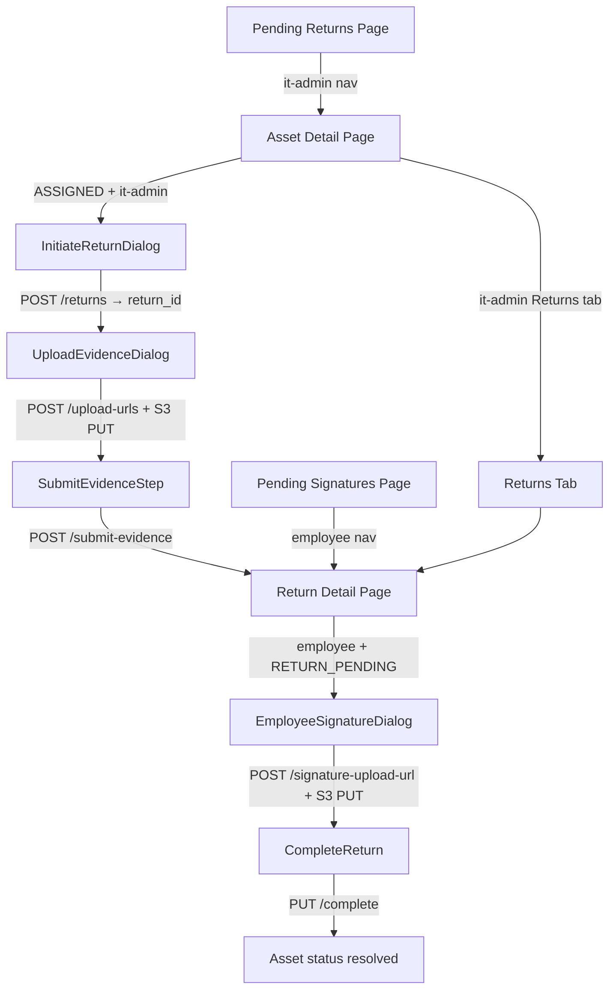

# Design Document: Asset Return Process

## Overview

The Asset Return Process feature implements the full end-to-end workflow for reclaiming an assigned asset from an employee. The IT Admin initiates the return, uploads photographic evidence and a digital signature, then submits to notify the employee. The employee reviews the return details, draws their own digital signature, and completes the return. The feature spans two new standalone pages (Pending Returns for IT Admin, Pending Signatures for Employee), a new Return Detail page nested under the asset, a new Returns tab on the Asset Detail page, and two multi-step dialogs (IT Admin flow and Employee flow) that match the provided mockup designs.

The implementation follows all existing patterns: TanStack Router file-based routing, TanStack Query with centralized query keys, TanStack Form + Zod for all forms, Shadcn UI components, and the centralized permissions module.


---

## Architecture



---

## Route Architecture

### New Route Files

All new routes live under `src/routes/_authenticated/`.

#### 1. `assets.$asset_id.returns.$return_id.tsx`

- Path: `/assets/:asset_id/returns/:return_id`
- Allowed roles: `['it-admin', 'employee']`
- `beforeLoad`: `hasRole(context.userRole, ALLOWED)` else redirect to `/unauthorized`
- `validateSearch`: none (no search params needed)
- SEO constant:

```typescript
const RETURN_DETAIL_SEO = {
  title: 'Return Detail',
  description: 'View return record details including evidence, signatures, and asset condition assessment for this return.',
  path: '/assets/returns/detail',
} satisfies SeoPageInput
```

- `head`: standard authenticated pattern (`getBaseMeta()` + `noindex, nofollow` + `getPageMeta` + `getCanonicalLink`)
- Component: `ReturnDetailPage` — calls `useReturnDetail(asset_id, return_id)`
- Parent route `assets.$asset_id.tsx` detects this child via `matchRoute` and renders `<Outlet />` instead of the full asset detail layout (same pattern as `isIssueDetailActive`)

#### 2. `pending-returns.tsx`

- Path: `/pending-returns`
- Allowed roles: `['it-admin']`
- `beforeLoad`: `hasRole(context.userRole, ['it-admin'])` else redirect to `/unauthorized`
- `validateSearch` Zod schema:

```typescript
const pendingReturnsSearchSchema = z.object({
  page: z.coerce.number().min(1).optional(),
})
```

- SEO constant:

```typescript
const PENDING_RETURNS_SEO = {
  title: 'Pending Returns',
  description: 'View assets with approved replacement issues awaiting return initiation by the IT Admin.',
  path: '/pending-returns',
} satisfies SeoPageInput
```

- Component: `PendingReturnsPage`

#### 3. `pending-signatures.tsx`

- Path: `/pending-signatures`
- Allowed roles: `['employee']`
- `beforeLoad`: `hasRole(context.userRole, ['employee'])` else redirect to `/unauthorized`
- `validateSearch` Zod schema:

```typescript
const pendingSignaturesSearchSchema = z.object({
  page: z.coerce.number().min(1).optional(),
})
```

- SEO constant:

```typescript
const PENDING_SIGNATURES_SEO = {
  title: 'Pending Signatures',
  description: 'View and complete outstanding return and handover signature tasks assigned to you.',
  path: '/pending-signatures',
} satisfies SeoPageInput
```

- Component: `PendingSignaturesPage`

### Modifications to Existing Routes

#### `assets.$asset_id.tsx`

Add `ret_page`, `ret_trigger`, `ret_condition` to `assetDetailSearchSchema`:

```typescript
ret_page: z.coerce.number().min(1).optional(),
ret_trigger: z.enum(['RESIGNATION','REPLACEMENT','TRANSFER','IT_RECALL','UPGRADE'] as const).optional(),
ret_condition: z.enum(['GOOD','MINOR_DAMAGE','MINOR_DAMAGE_REPAIR_REQUIRED','MAJOR_DAMAGE'] as const).optional(),
```

Add `isReturnDetailActive` matchRoute check (same pattern as `isIssueDetailActive`) so the Returns child route renders via `<Outlet />`.

Add `initiateReturn` search param to allow the Pending Returns page to deep-link with the dialog pre-opened:

```typescript
initiate_return: z.boolean().optional(),
```

---

## Component Architecture

### New Components

#### `src/components/returns/`

All return-specific components live in this new directory.

---

#### `ReturnTriggerSelector`

```typescript
type ReturnTriggerSelectorProps = {
  value: ReturnTrigger | ''
  onChange: (value: ReturnTrigger) => void
  disabled?: boolean
}
```

Renders the button-group grid from the mockup. Uses the existing `src/components/ui/button-group.tsx` as a base or a custom grid of toggle buttons. Layout: 2-column grid, 2 rows of 2 + 1 full-width row.

- RESIGNATION — person icon (`UserMinus`)
- REPLACEMENT — refresh icon (`RefreshCw`)
- TRANSFER — arrow icon (`ArrowRightLeft`)
- IT_RECALL — monitor icon (`MonitorX`)
- UPGRADE — upgrade icon (`ArrowUpCircle`) — full width

Selected state: `border-primary bg-primary/10 text-primary`. Unselected: `border-border text-muted-foreground`.

Labels from `ReturnTriggerLabels`.

---

#### `ReturnTriggerDisplay`

```typescript
type ReturnTriggerDisplayProps = {
  trigger: ReturnTrigger
}
```

Read-only version for the Employee dialog. Renders a single bordered row with the trigger icon + label. Not interactive.

---

#### `AssetDetailsCard`

```typescript
type AssetDetailsCardProps = {
  model: string | undefined
  serialNumber: string | undefined
  // IT Admin mode: shows condition dropdown (editable)
  mode: 'edit' | 'readonly'
  // edit mode only
  conditionValue?: ReturnCondition | ''
  onConditionChange?: (value: ReturnCondition) => void
  conditionInvalid?: boolean
}
```

The light blue/gray card from the mockup. Shows:
- DATABASE icon (blue) + "Asset Details" label
- MODEL row: label + value
- SERIAL NUMBER row: label + value
- CURRENT CONDITION row: label + `<Select>` (edit mode) or plain text (readonly mode)

Styled with `bg-info/10 border border-info/20 rounded-lg p-4`.

---

#### `EvidencePhotoGrid`

```typescript
type EvidencePhotoGridProps = {
  // upload mode: shows upload tile + previews
  mode: 'upload' | 'readonly'
  // upload mode
  files?: File[]
  onFilesChange?: (files: File[]) => void
  // readonly mode
  photoUrls?: string[]
}
```

3-column thumbnail grid. In upload mode: first cell is a dashed-border upload tile (camera+ icon + "Upload" label, opens file picker on click, accepts `image/jpeg,image/png`, max 10 files). Remaining cells show `` previews with remove button overlay. In readonly mode: all cells are clickable `<a>` thumbnails linking to the full URL.

---

#### `SignatureCard`

```typescript
type SignatureCardProps = {
  label: string          // e.g. "ADMIN SIGNATURE" or "USER SIGNATURE (SARAH JENKINS)"
  idLabel?: string       // e.g. "ID: ADMIN-882-J" — shown bottom-right, IT Admin only
  onClear: () => void
  sigRef: React.RefObject<SignatureCanvas>
  disabled?: boolean
}
```

Bordered card matching the mockup. Header row: label (blue, uppercase, small) on left + "CLEAR" text button on right. Body: `react-signature-canvas` component filling the card (`h-[200px]`, white background). Optional `idLabel` in bottom-right corner in `text-muted-foreground text-xs`.

Uses `react-signature-canvas` directly (not the existing `SignatureCapture` which has Draw/Upload tabs — the return flow is draw-only per the mockup).

---

#### `HandoverTimestampPill`

```typescript
type HandoverTimestampPillProps = {
  label: string   // "HANDOVER TIMESTAMP" or "RETURN TIMESTAMP"
  timestamp: string
}
```

Pill/chip row from the mockup. Bordered info row: label on left (uppercase, small, muted), timestamp + clock icon on right. `border rounded-full px-4 py-1.5 flex items-center justify-between`.

---

#### `InitiateReturnDialog`

```typescript
type InitiateReturnDialogProps = {
  open: boolean
  onOpenChange: (open: boolean) => void
  assetId: string
  asset: {
    model?: string
    serial_number?: string
  }
  // Called with return_id on success so parent can open UploadEvidenceDialog
  onSuccess: (returnId: string) => void
}
```

Two-column dialog matching the IT Admin mockup. Uses TanStack Form + Zod.

Form schema:

```typescript
const initiateReturnSchema = z.object({
  return_trigger: z.enum(['RESIGNATION','REPLACEMENT','TRANSFER','IT_RECALL','UPGRADE'], {
    required_error: 'Return trigger is required',
  }),
  condition_assessment: z.enum(['GOOD','MINOR_DAMAGE','MINOR_DAMAGE_REPAIR_REQUIRED','MAJOR_DAMAGE'], {
    required_error: 'Condition assessment is required',
  }),
  reset_status: z.enum(['COMPLETE','INCOMPLETE'], {
    required_error: 'Reset status is required',
  }),
  remarks: z.string().min(1, 'Remarks are required'),
})
```

Left column layout:
1. Section label "PURPOSE OF RETURN"
2. `<ReturnTriggerSelector>` bound to `return_trigger` field
3. `<AssetDetailsCard mode="edit">` bound to `condition_assessment` field — model/serial from props
4. Section label "RESET STATUS"
5. Radio group for `reset_status` (COMPLETE / INCOMPLETE) using Shadcn `RadioGroup`
6. Section label "REMARKS"
7. `<Textarea>` bound to `remarks` field

Right column layout:
1. `<HandoverTimestampPill>` showing current time (captured when dialog opens via `useState(() => new Date().toISOString())`)
2. Section label "EVIDENCE PHOTOS" — note: photos are uploaded in the next step; this column shows a placeholder message "Photos will be uploaded in the next step."
3. Section label "HANDOVER VERIFICATION"
4. `<SignatureCard>` for admin signature — note: signature is also uploaded in the next step; show placeholder "Signature will be captured in the next step."

Footer: [Cancel] (outline) + [Next: Upload Evidence] (primary, shield icon) — submit button calls `form.handleSubmit()`.

On submit: calls `useInitiateReturn(assetId).mutate({ return_trigger })`. Note: per the types, `InitiateReturnRequest` only has `return_trigger`. The `condition_assessment`, `reset_status`, and `remarks` are passed to `CompleteReturnRequest` — but per Requirement 1.2, the form collects all four fields. The design resolves this by storing the extra fields in the dialog's local state and passing them to the Upload Evidence dialog, which then passes them to the Complete Return call.

Wait — re-reading the requirements and types carefully: `InitiateReturnRequest` only has `return_trigger`. `CompleteReturnRequest` has `serial_number`, `model`, `condition_assessment`, `remarks`, `reset_status`. The form in Requirement 1.2 collects all four fields upfront. The `condition_assessment`, `reset_status`, and `remarks` values collected here are stored in parent state and used when the employee completes the return (Requirement 7). However, since the employee completes the return (not the IT Admin), and `CompleteReturnRequest` is called by the employee, the IT Admin's form values for condition/remarks/reset must be stored somewhere accessible to the employee flow.

Re-reading Requirement 7.1: `PUT /assets/{asset_id}/returns/{return_id}/complete` with `{ user_signature_s3_key }` — this is the employee's call. But `CompleteReturnRequest` has `serial_number`, `model`, `condition_assessment`, `remarks`, `reset_status`. This means the complete call includes all those fields too.

Design decision: The IT Admin's `condition_assessment`, `reset_status`, and `remarks` are submitted as part of the `CompleteReturnRequest` by the employee. The employee's dialog (read-only summary) shows these values fetched from `GetReturnResponse`. The employee's complete call sends `{ user_signature_s3_key: s3_key }` — but the actual `CompleteReturnRequest` type requires more fields. This is a backend concern; the frontend sends what the API requires. Looking at `CompleteReturnRequest`: `{ serial_number, model, condition_assessment, remarks, reset_status }` — these are the IT Admin's assessed values already stored in the return record. The employee's complete endpoint likely only needs `user_signature_s3_key`. The `CompleteReturnRequest` type may be the IT Admin's submit-evidence payload, not the employee's complete payload.

Given the ambiguity, the design will treat the `InitiateReturnDialog` as collecting `return_trigger` only (matching `InitiateReturnRequest`), and the Upload Evidence dialog will also collect `condition_assessment`, `reset_status`, and `remarks` as part of the evidence submission step. This aligns with the actual API types.

**Revised form schema for `InitiateReturnDialog`:**

```typescript
const initiateReturnSchema = z.object({
  return_trigger: z.enum(['RESIGNATION','REPLACEMENT','TRANSFER','IT_RECALL','UPGRADE'], {
    required_error: 'Return trigger is required',
  }),
})
```

The dialog is simplified: left column shows only the trigger selector + asset details card (read-only). The condition/remarks/reset fields move to the Upload Evidence dialog.

---

#### `UploadEvidenceDialog`

```typescript
type UploadEvidenceDialogProps = {
  open: boolean
  onOpenChange: (open: boolean) => void
  assetId: string
  returnId: string
  asset: {
    model?: string
    serial_number?: string
  }
  initiatedAt: string
  onSuccess: () => void
}
```

Full two-column dialog matching the IT Admin mockup. This is the main evidence + signature capture dialog.

Left column:
1. Section label "PURPOSE OF RETURN" — read-only display of the trigger (fetched from return detail or passed as prop)
2. `<AssetDetailsCard mode="edit">` — condition assessment dropdown
3. Section label "RESET STATUS" — radio group
4. Section label "REMARKS" — textarea

Right column:
1. `<HandoverTimestampPill label="HANDOVER TIMESTAMP" timestamp={initiatedAt}>`
2. Section label "EVIDENCE PHOTOS"
3. `<EvidencePhotoGrid mode="upload">` — photo selection
4. Section label "HANDOVER VERIFICATION"
5. `<SignatureCard label="ADMIN SIGNATURE" idLabel={adminIdLabel} sigRef={sigRef} onClear={handleClear}>`

Form schema:

```typescript
const uploadEvidenceSchema = z.object({
  condition_assessment: z.enum(['GOOD','MINOR_DAMAGE','MINOR_DAMAGE_REPAIR_REQUIRED','MAJOR_DAMAGE'], {
    required_error: 'Condition assessment is required',
  }),
  reset_status: z.enum(['COMPLETE','INCOMPLETE'], {
    required_error: 'Reset status is required',
  }),
  remarks: z.string().min(1, 'Remarks are required'),
})
```

State machine (see State Management section). Footer: [Cancel] (outline) + [Complete Return] (primary, shield-check icon).

---

#### `EmployeeSignatureDialog`

```typescript
type EmployeeSignatureDialogProps = {
  open: boolean
  onOpenChange: (open: boolean) => void
  assetId: string
  returnId: string
  returnData: GetReturnResponse
  employeeName: string
  onSuccess: () => void
}
```

Two-column dialog matching the Employee mockup. Read-only left column, signature right column.

Left column:
1. Section label "PURPOSE OF RETURN"
2. `<ReturnTriggerDisplay trigger={returnData.return_trigger}>`
3. `<AssetDetailsCard mode="readonly">` — model, serial, condition from `returnData`
4. Section label "REMARKS"
5. Read-only textarea (or `<p>`) showing `returnData.remarks`

Right column:
1. `<HandoverTimestampPill label="RETURN TIMESTAMP" timestamp={returnData.initiated_at}>`
2. Section label "EVIDENCE PHOTOS"
3. `<EvidencePhotoGrid mode="readonly" photoUrls={returnData.return_photo_urls}>`
4. Section label "HANDOVER VERIFICATION"
5. `<SignatureCard label={`USER SIGNATURE (${employeeName.toUpperCase()})`} sigRef={sigRef} onClear={handleClear}>`

Footer: [Cancel] (outline) + [Complete Return] (primary, shield-check icon).

On submit: exports canvas as PNG blob → calls `useGenerateReturnSignatureUploadUrl` → S3 PUT → calls `useCompleteReturn` with `{ user_signature_s3_key }`.

---

#### `ReturnStatusBadge`

```typescript
type ReturnStatusBadgeProps = {
  status: AssetStatus | undefined
  // "pending" shown when resolved_status is null
}
```

Badge variants for return-related statuses:

| Status | Variant | Label |
|---|---|---|
| `undefined` / null | `warning` | "Pending" |
| `IN_STOCK` | `success` | "In Stock" |
| `DAMAGED` | `warning` | "Damaged" |
| `REPAIR_REQUIRED` | `warning` | "Repair Required" |
| `DISPOSAL_REVIEW` | `danger` | "Disposal Review" |

Uses `AssetStatusLabels` for the label text.

---

#### `ReturnsTab`

```typescript
type ReturnsTabProps = {
  assetId: string
  search: { ret_page?: number; ret_trigger?: ReturnTrigger; ret_condition?: ReturnCondition }
  onSearchChange: (updates: Record<string, unknown>) => void
}
```

Renders the Returns tab content on the Asset Detail page. Contains toolbar (Filters button + Clear all), `<DataTable>`, and pagination. Columns defined with `createColumnHelper<ReturnListItem>()` outside the component.

Columns:
- Return Trigger: `ReturnTriggerLabels[row.return_trigger]`
- Condition: `<ReturnConditionBadge status={row.condition_assessment}>` (or "—" if null)
- Initiated By: `row.initiated_by`
- Initiated At: `formatDate(row.initiated_at) || '—'`
- Status: `<ReturnStatusBadge status={row.resolved_status}>`
- Completed At: `formatDate(row.completed_at) || '—'`
- Actions: eye icon → `/assets/${assetId}/returns/${row.return_id}`

Filter dialog fields: Return Trigger (Select), Condition Assessment (Select).

---

#### `ReturnConditionBadge`

```typescript
type ReturnConditionBadgeProps = {
  condition: ReturnCondition | undefined
}
```

| Condition | Variant |
|---|---|
| `GOOD` | `success` |
| `MINOR_DAMAGE` | `warning` |
| `MINOR_DAMAGE_REPAIR_REQUIRED` | `warning` |
| `MAJOR_DAMAGE` | `danger` |

Uses `ReturnConditionLabels`.

---

#### `ResetStatusBadge`

```typescript
type ResetStatusBadgeProps = {
  status: ResetStatus | undefined
}
```

| Status | Variant |
|---|---|
| `COMPLETE` | `success` |
| `INCOMPLETE` | `danger` |

Uses `ResetStatusLabels`.

---

## Dialog UI Specification

### IT Admin Dialog — "Asset Return"

Rendered as a `<Dialog>` with `DialogContent` sized to `max-w-4xl` (two-column layout). The dialog header is pinned, the body scrolls, and the footer is pinned.

```
DialogContent (max-w-4xl)
├── DialogHeader
│   ├── DialogTitle: "Asset Return"
│   └── DialogDescription: "Complete the offboarding process for asset "
│       └── <Link to="/assets/$asset_id">asset_id</Link>  ← blue hyperlink
├── div.overflow-y-auto.-mx-1.px-1  ← scrollable body
│   └── div.grid.grid-cols-2.gap-6
│       ├── LEFT COLUMN
│       │   ├── p.text-xs.font-semibold.uppercase.tracking-wider.text-muted-foreground
│       │   │   "PURPOSE OF RETURN"
│       │   ├── <ReturnTriggerSelector>
│       │   ├── <AssetDetailsCard mode="edit">
│       │   ├── p "RESET STATUS"
│       │   ├── <RadioGroup> (COMPLETE / INCOMPLETE)
│       │   ├── p "REMARKS"
│       │   └── <Textarea>
│       └── RIGHT COLUMN
│           ├── <HandoverTimestampPill>
│           ├── p "EVIDENCE PHOTOS"
│           ├── <EvidencePhotoGrid mode="upload">
│           ├── p "HANDOVER VERIFICATION"
│           └── <SignatureCard label="ADMIN SIGNATURE" idLabel="ID: {userId}">
└── DialogFooter
    ├── <Button variant="outline">Cancel</Button>
    └── <Button> <ShieldCheck /> Complete Return</Button>
```

**ReturnTriggerSelector grid layout:**

```
┌─────────────────┬─────────────────┐
│  👤 Resignation │  🔄 Replacement │
├─────────────────┼─────────────────┤
│  ↔ Transfer     │  🖥 IT Recall   │
├─────────────────────────────────────┤
│         ⬆ Hardware Upgrade          │
└─────────────────────────────────────┘
```

Each button: `border rounded-lg p-3 flex flex-col items-center gap-1.5 text-sm cursor-pointer transition-colors`. Selected: `border-primary bg-primary/10 text-primary`. Unselected: `border-border text-muted-foreground hover:border-primary/50`.

**AssetDetailsCard styling:**

```
div.bg-info/10.border.border-info/20.rounded-lg.p-4.space-y-3
├── div.flex.items-center.gap-2
│   ├── <Database className="size-4 text-info" />
│   └── span.text-sm.font-semibold "Asset Details"
├── div.grid.grid-cols-[auto_1fr].gap-x-4.gap-y-2.text-sm
│   ├── span.text-xs.font-semibold.text-muted-foreground "MODEL"
│   ├── span model value
│   ├── span.text-xs.font-semibold.text-muted-foreground "SERIAL NUMBER"
│   ├── span serial_number value
│   ├── span.text-xs.font-semibold.text-muted-foreground "CURRENT CONDITION"
│   └── <Select> (edit) or span (readonly)
```

**EvidencePhotoGrid upload mode:**

```
div.grid.grid-cols-3.gap-3
├── div.border-2.border-dashed.rounded-lg.aspect-square  ← upload tile
│   ├── <Camera className="size-6 text-muted-foreground" />
│   └── span.text-xs "Upload"
├── div.rounded-lg.overflow-hidden.aspect-square.relative  ← photo preview
│   ├── 
│   └── button.absolute.top-1.right-1 (remove, X icon)
└── ... (up to 8 more photo cells)
```

**SignatureCard:**

```
div.border.rounded-lg.overflow-hidden
├── div.flex.items-center.justify-between.px-3.py-2.border-b.bg-muted/30
│   ├── span.text-xs.font-semibold.uppercase.text-primary label
│   └── <Button variant="ghost" size="sm">Clear</Button>
├── div.bg-white.relative  ← canvas container
│   └── <SignatureCanvas ref={sigRef} canvasProps={{ className: 'w-full h-[200px]' }} />
└── div.px-3.py-1.text-right  ← only if idLabel present
    └── span.text-xs.text-muted-foreground idLabel
```

**HandoverTimestampPill:**

```
div.flex.items-center.justify-between.border.rounded-full.px-4.py-1.5
├── span.text-xs.font-semibold.uppercase.text-muted-foreground label
└── div.flex.items-center.gap-1.5
    ├── span.text-sm timestamp (formatDate)
    └── <Clock className="size-3.5 text-muted-foreground" />
```

---

### Employee Dialog — "Asset Return"

Same shell (`max-w-4xl`, two-column, pinned header/footer). Left column is fully read-only.

Left column differences from IT Admin:
- `<ReturnTriggerDisplay>` instead of `<ReturnTriggerSelector>` — single bordered row, not interactive
- `<AssetDetailsCard mode="readonly">` — no dropdown, all plain text
- Remarks shown as `<p className="text-sm bg-muted/30 rounded-lg p-3 min-h-[80px]">` (read-only styled block)

Right column differences:
- `<EvidencePhotoGrid mode="readonly">` — all 3 cells are photo thumbnails, no upload tile
- `<SignatureCard label="USER SIGNATURE (EMPLOYEE NAME)">` — no `idLabel`
- Placeholder text "Sign here" in muted gray shown when canvas is empty (achieved via CSS `::before` pseudo or an overlay `<p>` that hides when canvas has strokes)

---

## Data Layer

### `src/hooks/use-returns.ts`

```typescript
// Query hooks
export function useReturnDetail(assetId: string, returnId: string): UseQueryResult<GetReturnResponse>
export function useReturns(assetId: string, filters: ListReturnsFilter, page: number, pageSize?: number): UseQueryResult<ListReturnsResponse>
export function usePendingReturns(page: number, pageSize?: number): UseQueryResult<ListPendingReturnsResponse>
export function usePendingSignatures(page: number, pageSize?: number): UseQueryResult<ListPendingSignaturesResponse>

// Mutation hooks
export function useInitiateReturn(assetId: string): UseMutationResult<InitiateReturnResponse, Error, InitiateReturnRequest>
export function useGenerateReturnUploadUrls(assetId: string, returnId: string): UseMutationResult<GenerateReturnUploadUrlsResponse, Error, GenerateReturnUploadUrlsRequest>
export function useSubmitAdminEvidence(assetId: string, returnId: string): UseMutationResult<void, Error, void>
export function useGenerateReturnSignatureUploadUrl(assetId: string, returnId: string): UseMutationResult<{ presigned_url: string; s3_key: string }, Error, { file_name: string }>
export function useCompleteReturn(assetId: string, returnId: string): UseMutationResult<CompleteReturnResponse, Error, { user_signature_s3_key: string }>
```

All query hooks use `staleTime: 60_000`. All mutation hooks call `queryClient.invalidateQueries` in `onSettled`.

API endpoints:
- `POST /assets/{assetId}/returns` → `useInitiateReturn`
- `GET /assets/{assetId}/returns/{returnId}` → `useReturnDetail`
- `GET /assets/{assetId}/returns` → `useReturns`
- `GET /assets/pending-returns` → `usePendingReturns`
- `GET /users/me/pending-signatures` → `usePendingSignatures`
- `POST /assets/{assetId}/returns/{returnId}/upload-urls` → `useGenerateReturnUploadUrls`
- `POST /assets/{assetId}/returns/{returnId}/submit-evidence` → `useSubmitAdminEvidence`
- `POST /assets/{assetId}/returns/{returnId}/signature-upload-url` → `useGenerateReturnSignatureUploadUrl`
- `PUT /assets/{assetId}/returns/{returnId}/complete` → `useCompleteReturn`

### Invalidation Strategy

| Mutation | Invalidates |
|---|---|
| `useInitiateReturn` | `queryKeys.assets.detail(assetId)`, `queryKeys.returns.list(assetId, {})`, `queryKeys.issues.pendingReturns({})` |
| `useGenerateReturnUploadUrls` | none (presigned URLs, no cache impact) |
| `useSubmitAdminEvidence` | `queryKeys.returns.detail(assetId, returnId)`, `queryKeys.returns.pendingSignatures({})` |
| `useGenerateReturnSignatureUploadUrl` | none |
| `useCompleteReturn` | `queryKeys.assets.detail(assetId)`, `queryKeys.returns.detail(assetId, returnId)`, `queryKeys.returns.pendingSignatures({})` |

### `src/lib/query-keys.ts` — `returns` namespace

```typescript
returns: {
  all: () => ['returns'] as const,
  list: (assetId: string, filters: ListReturnsFilter) =>
    [...queryKeys.returns.all(), 'list', assetId, filters] as const,
  detail: (assetId: string, returnId: string) =>
    [...queryKeys.returns.all(), 'detail', assetId, returnId] as const,
  pendingReturns: (filters: ListPendingReturnsFilter) =>
    [...queryKeys.returns.all(), 'pending-returns', filters] as const,
  pendingSignatures: (filters: Record<string, unknown>) =>
    [...queryKeys.returns.all(), 'pending-signatures', filters] as const,
},
```

---

## Permissions

### `getReturnDetailPermissions`

```typescript
export type ReturnDetailContext = {
  role: UserRole | null
  assetStatus: AssetStatus | undefined
  adminSignatureUrl: string | undefined | null
  userSignatureUrl: string | undefined | null
}

export type ReturnDetailPermissions = {
  canUploadEvidence: boolean
  canRenotifyEmployee: boolean
  canSignAndComplete: boolean
  canViewReturnsTab: boolean
}

export function getReturnDetailPermissions(ctx: ReturnDetailContext): ReturnDetailPermissions {
  const { role, assetStatus, adminSignatureUrl, userSignatureUrl } = ctx
  const isPending = assetStatus === 'RETURN_PENDING'

  return {
    canUploadEvidence: hasRole(role, ['it-admin']) && isPending && !adminSignatureUrl,
    canRenotifyEmployee: hasRole(role, ['it-admin']) && isPending && !!adminSignatureUrl && !userSignatureUrl,
    canSignAndComplete: hasRole(role, ['employee']) && isPending && !userSignatureUrl,
    canViewReturnsTab: hasRole(role, ['it-admin']),
  }
}
```

### `getAssetDetailPermissions` extension

Add `showInitiateReturnButton` to `AssetDetailPermissions`:

```typescript
showInitiateReturnButton: hasRole(role, ['it-admin']) && assetStatus === 'ASSIGNED',
```

---

## State Management

### IT Admin Multi-Step Flow

The IT Admin flow is managed by a state machine in the parent component (`AssetDetailPage` or `ReturnDetailPage`). The state is local `useState` — no URL state needed since it's a transient dialog flow.

```typescript
type ReturnFlowState =
  | { step: 'idle' }
  | { step: 'initiate' }
  | { step: 'upload-evidence'; returnId: string; initiatedAt: string }
  | { step: 'done' }
```

Transitions:
1. `idle` → `initiate`: user clicks "Initiate Return" button
2. `initiate` → `upload-evidence`: `useInitiateReturn` succeeds, `returnId` from response
3. `upload-evidence` → `done`: `useSubmitAdminEvidence` succeeds
4. Any step → `idle`: user clicks Cancel or dialog closes

The `UploadEvidenceDialog` internal state machine:

```typescript
type UploadStep =
  | { phase: 'form' }                          // filling form + selecting photos + drawing signature
  | { phase: 'uploading'; progress: number }   // uploading files to S3
  | { phase: 'submitting' }                    // calling submit-evidence
  | { phase: 'done' }
```

The upload phase:
1. User clicks "Complete Return" → validate form
2. Export signature canvas as PNG blob
3. Call `useGenerateReturnUploadUrls` with all photo files + signature file manifest
4. On success: `Promise.allSettled` all S3 PUT requests
5. If any PUT returns 403: `toast.error('Upload link expired. Please try again.')` → reset to `form` phase
6. If all succeed: call `useSubmitAdminEvidence`
7. On submit-evidence success: `toast.success(...)` → transition to `done` → call `onSuccess()`

### Employee Flow

Simpler — single dialog, no multi-step state machine needed. Internal state:

```typescript
type EmployeeUploadState = 'idle' | 'uploading-signature' | 'completing'
```

1. User clicks "Complete Return" → export canvas → call `useGenerateReturnSignatureUploadUrl`
2. S3 PUT with blob
3. On success: call `useCompleteReturn({ user_signature_s3_key })`
4. On complete success: `toast.success('Return completed successfully.')` → navigate to `/` (dashboard)

---

## File Upload Flow

### IT Admin Evidence Upload

```pascal
PROCEDURE uploadEvidence(photos: File[], signatureBlob: Blob, formValues: UploadEvidenceFormValues)

  // 1. Build file manifest
  manifest ← []
  FOR each photo IN photos DO
    manifest.push({ name: photo.name, type: "photo" })
  END FOR
  manifest.push({ name: "admin-signature.png", type: "admin-signature" })

  // 2. Get presigned URLs
  urlsResponse ← POST /upload-urls with { files: manifest }

  // 3. Upload all files in parallel
  allFiles ← [...photos, signatureBlob]
  results ← Promise.allSettled(
    urlsResponse.upload_urls.map((url, i) =>
      fetch(url.presigned_url, { method: 'PUT', body: allFiles[i], headers: { 'Content-Type': contentType(allFiles[i]) } })
    )
  )

  // 4. Check for 403 (expired URL)
  IF any result has status 403 THEN
    toast.error('Upload link expired. Please try again.')
    RETURN failure
  END IF

  // 5. Check for other failures
  IF any result failed or not ok THEN
    toast.error('One or more files failed to upload. Please try again.')
    RETURN failure
  END IF

  // 6. Submit evidence
  POST /submit-evidence (empty body)
  toast.success('Evidence submitted. Employee has been notified.')

END PROCEDURE
```

Content-type logic: `File` objects have `.type` property. For the signature blob, use `'image/png'`.

### Employee Signature Upload

```pascal
PROCEDURE uploadEmployeeSignature(sigRef: SignatureCanvas)

  // 1. Export canvas
  blob ← sigRef.current.getCanvas().toBlob('image/png')
  IF blob IS NULL THEN
    toast.error('Please draw your signature before submitting.')
    RETURN
  END IF

  // 2. Get presigned URL
  urlResponse ← POST /signature-upload-url with { file_name: "user-signature.png" }

  // 3. Upload
  response ← fetch(urlResponse.presigned_url, { method: 'PUT', body: blob, headers: { 'Content-Type': 'image/png' } })

  IF response.status === 403 THEN
    toast.error('Upload link expired. Please refresh and try again.')
    RETURN
  END IF

  // 4. Complete return
  PUT /complete with { user_signature_s3_key: urlResponse.s3_key }
  toast.success('Return completed successfully.')
  navigate to dashboard

END PROCEDURE
```

---

## Navigation Integration

### IT Admin Navigation

The "Pending Returns" page is added to the main nav for `it-admin` role. The nav item is conditionally rendered using `hasRole(role, ['it-admin'])`. Route: `/pending-returns`.

### Employee Navigation

The "Pending Signatures" page is added to the main nav for `employee` role. The nav item is conditionally rendered using `hasRole(role, ['employee'])`. Route: `/pending-signatures`.

### Deep-link from Pending Returns to Initiate Dialog

When the IT Admin clicks "Initiate Return" on the Pending Returns page, navigate to:

```typescript
navigate({
  to: '/assets/$asset_id',
  params: { asset_id: row.asset_id },
  search: { initiate_return: true },
})
```

The `AssetDetailPage` reads `search.initiate_return` and auto-opens the `InitiateReturnDialog` on mount via `useEffect`.

### Returns Tab on Asset Detail

The Returns tab is added to the existing `<Tabs>` component in `AssetDetailPage` when `canViewReturnsTab` is true. Tab value: `'returns'`. The `assetDetailSearchSchema` is extended with `ret_page`, `ret_trigger`, `ret_condition` params (prefixed to avoid collision with `sr_` and `issues_` params).

---

## Labels & Badges Summary

| Entity | Component | Variants |
|---|---|---|
| `ReturnCondition` | `ReturnConditionBadge` | `success` (GOOD), `warning` (MINOR_DAMAGE, MINOR_DAMAGE_REPAIR_REQUIRED), `danger` (MAJOR_DAMAGE) |
| `ResetStatus` | `ResetStatusBadge` | `success` (COMPLETE), `danger` (INCOMPLETE) |
| `resolved_status` (nullable) | `ReturnStatusBadge` | `warning` (null/undefined = Pending), `success` (IN_STOCK), `warning` (DAMAGED, REPAIR_REQUIRED), `danger` (DISPOSAL_REVIEW) |
| `document_type` | inline `<Badge>` | `info` (Return), `default` (Handover) |

All label text sourced from `ReturnConditionLabels`, `ResetStatusLabels`, `ReturnTriggerLabels`, `AssetStatusLabels` from `src/lib/models/labels.ts`.

---

## Return Detail Page Layout

The `ReturnDetailPage` component follows the same two-column layout as `IssueDetailPage` (`lg:grid-cols-3`, left `lg:col-span-2`, right sidebar).

Left column cards:
1. **Return Info** — `return_trigger` (label), `initiated_by`, `initiated_at` (`formatDate`)
2. **Device Info** — `serial_number` (or "N/A"), `model` (or "N/A")
3. **Condition Assessment** — `<ReturnConditionBadge>`, `<ResetStatusBadge>`, `remarks`
4. **Admin Evidence** — photo gallery (`<EvidencePhotoGrid mode="readonly">`), admin signature `` (or "Not yet uploaded")
5. **Employee Evidence** — user signature `` (or "Pending employee signature")
6. **Completion** (conditional on `completed_at`) — `completed_by`, `formatDate(completed_at)`, `<ReturnStatusBadge status={resolved_status}>`

Right sidebar:
1. **Status card** — `<Badge>` for `asset_status` using `AssetStatusLabels`
2. **Actions card** — conditional action buttons based on `getReturnDetailPermissions`:
   - `canUploadEvidence`: "Upload Evidence" button → opens `UploadEvidenceDialog`
   - `canRenotifyEmployee`: "Re-notify Employee" button → calls `useSubmitAdminEvidence` directly
   - `canSignAndComplete`: "Sign & Complete Return" button → opens `EmployeeSignatureDialog`

Error handling: 403 and 404 from `useReturnDetail` render `<div className="alert-danger">` inline (data loading error pattern).

---

## Pending Returns Page Layout

Standard page layout matching other list pages (e.g. `approvals.tsx`).

```
<main className="page-base">
  <h1 className="page-title">Pending Returns</h1>
  <p className="page-subtitle">Assets awaiting return initiation</p>

  <!-- Toolbar: pagination info only, no filters needed -->

  <DataTable columns={columns} data={items} />

  <!-- Pagination -->
</main>
```

Columns (using `createColumnHelper<PendingReturnItem>()`):
- Asset ID: `<Link to="/assets/$asset_id">` (eye icon button in actions column)
- Brand / Model: `${row.brand ?? '—'} ${row.model ?? '—'}`
- Serial Number: `row.serial_number ?? 'N/A'`
- Assigned To: `row.assignee_fullname ?? '—'`
- Replacement Approved At: `formatDate(row.replacement_approved_at) || '—'`
- Replacement Justification: truncated to 60 chars
- Management Remarks: truncated to 60 chars
- Actions: eye icon → `/assets/${row.asset_id}` + dropdown with "Initiate Return" item → navigates with `initiate_return: true` search param

---

## Pending Signatures Page Layout

```
<main className="page-base">
  <h1 className="page-title">Pending Signatures</h1>
  <p className="page-subtitle">Outstanding signature tasks</p>

  <DataTable columns={columns} data={items} />

  <!-- Pagination -->
</main>
```

Columns (using `createColumnHelper<PendingSignatureItem>()`):
- Type: `<Badge variant={row.document_type === 'return' ? 'info' : 'default'}>` with label "Return" or "Handover"
- Asset ID: plain text (link in actions column)
- Return Trigger: `row.return_trigger ? ReturnTriggerLabels[row.return_trigger] : '—'`
- Initiated At: `formatDate(row.initiated_at) || '—'`
- Actions: eye icon → navigates to return detail (`/assets/${row.asset_id}/returns/${row.record_id}`) for return type, or asset detail (`/assets/${row.asset_id}`) for handover type

No filter dialog needed (no filterable fields in the spec).

---

## Correctness Properties

- For all `ReturnTrigger` values `t`, `ReturnTriggerLabels[t]` is defined and non-empty.
- For all `ReturnCondition` values `c`, `ReturnConditionLabels[c]` is defined and `ReturnConditionBadge` renders a non-null badge.
- `getReturnDetailPermissions` with `role = 'it-admin'` and `assetStatus = 'RETURN_PENDING'` and `adminSignatureUrl = null` returns `canUploadEvidence = true` and all other action flags `false`.
- `getReturnDetailPermissions` with `role = 'employee'` and `assetStatus = 'RETURN_PENDING'` and `userSignatureUrl = null` returns `canSignAndComplete = true`.
- `getReturnDetailPermissions` with `role = 'management'` returns all action flags `false`.
- `showInitiateReturnButton` is `true` only when `role = 'it-admin'` AND `assetStatus = 'ASSIGNED'`.
- The upload evidence flow never calls `submit-evidence` if any S3 PUT returned a non-2xx status.
- The complete return flow never calls `PUT /complete` if the S3 signature upload returned a non-2xx status.
- `formatDate` is used for all date fields; no raw ISO strings are rendered in JSX.
- All mutation `onSettled` callbacks call `queryClient.invalidateQueries` using `queryKeys` factory — no raw string arrays.
